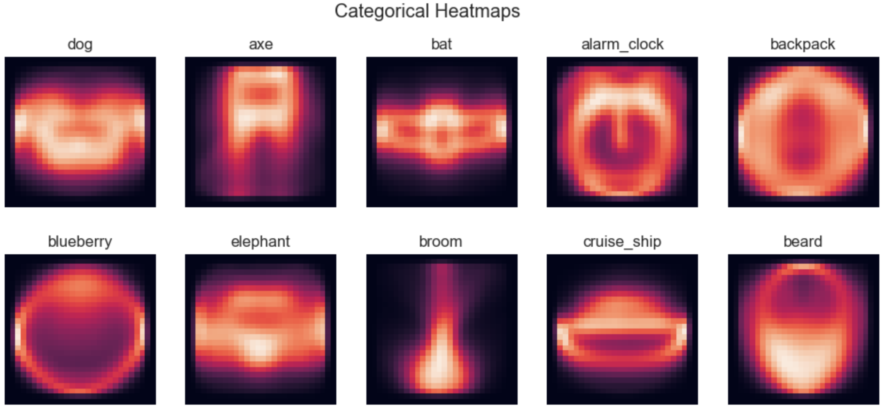
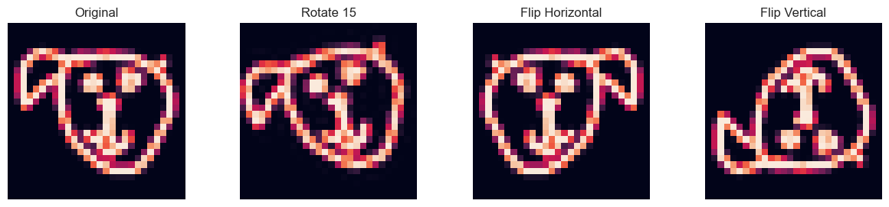
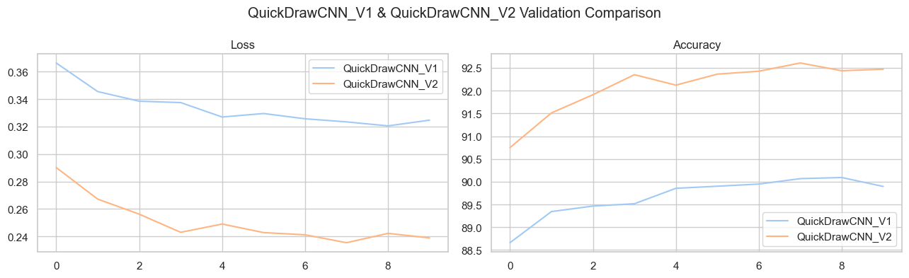

# Quick Draw Neural Network

## Overview

This project involves building a Deep Convolutional Neural Network (CNN) to classify drawings from the [Quick Draw Dataset](https://quickdraw.withgoogle.com/data). The dataset consists of 50 million drawings across 345 categories, contributed by players of the game Quick, Draw!.

## Project Structure

- **Data Processing**: The dataset is preprocessed into 28x28 grayscale images in `.npy` format.
- **Model Architecture**: Two CNN architectures are implemented:
  - `QuickDrawCNN_V1`: A simpler model.
  - `QuickDrawCNN_V2`: A more complex model with additional layers, batch normalization, and dropout.
- **Training and Evaluation**: Models are trained and evaluated on a subset of the dataset.

## Setup Instructions

1. **Clone the Repository**:

   ```bash
   git clone https://github.com/SafoanMiah/quick-draw-neural-net.git
   cd quick-draw-neural-net
   ```

2. **Install Dependencies**:

   ```bash
   pip install -r requirements.txt
   ```

3. **Download Dataset**:
   Follow the instructions in the `notebook.ipynb` to download and preprocess the dataset.

4. **Run the Notebook**:
   Open `main.ipynb` in Jupyter Notebook and execute the cells to train and evaluate the models.

## Findings

- **Model Performance**:

  - `QuickDrawCNN_V1` achieved a validation accuracy of **89.90%** and a true test accuracy of **84.74%**.
  - `QuickDrawCNN_V2` improved to a validation accuracy of **92.47%** and a true test accuracy of **88.57%**.
  - `QuickDrawCNN_V2 XL`, trained on an augmented dataset, achieved the highest true test accuracy of **95.31%**.

- **Data Augmentation**: Augmenting the dataset with rotated and flipped images significantly improved the model's ability to generalize.

## Visualizations

### Model Architecture: QuickDrawCNN_V2

| Layer Type    | Output Shape | Parameters |
| ------------- | ------------ | ---------- |
| Conv2d + ReLU | (16, 28, 28) | 416        |
| BatchNorm2d   | (16, 28, 28) | 32         |
| MaxPool2d     | (16, 14, 14) | 0          |
| Conv2d + ReLU | (32, 14, 14) | 12,832     |
| BatchNorm2d   | (32, 14, 14) | 64         |
| MaxPool2d     | (32, 7, 7)   | 0          |
| Conv2d + ReLU | (64, 7, 7)   | 18,496     |
| BatchNorm2d   | (64, 7, 7)   | 128        |
| MaxPool2d     | (64, 3, 3)   | 0          |
| Flatten       | (576)        | 0          |
| Linear + ReLU | (256)        | 147,712    |
| Dropout       | (256)        | 0          |
| Linear        | (n_classes)  | 2,570      |

### Heatmap Visualization


### Augmented Examples


### Training and Validation Metrics


## Conclusion

The `QuickDrawCNN_V2 XL` model, trained on an augmented dataset, demonstrated the best performance, indicating that data augmentation is crucial for improving model generalization. This model will be used for deployment via a Web API.

## Future Work

- Explore additional data augmentation techniques.
- Implement a web interface for real-time drawing classification.

## References

- [Quick Draw Dataset](https://quickdraw.withgoogle.com/data)
- [Full GitHub Project](https://github.com/SafoanMiah/quick-draw-neural-net)

_Note: The accuracies may vary slightly on re-runs due to the stochastic nature of training._
